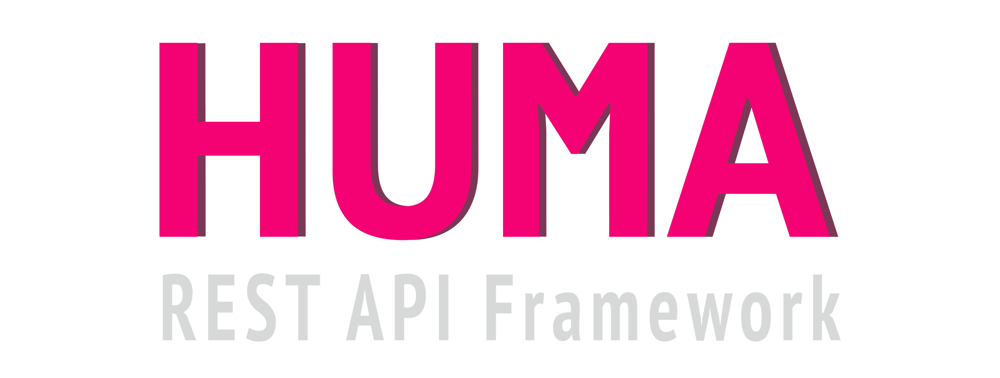

# BiOME : Biodiversity and Occurrences for Molecular Ecology


BiOME is a self-hostable platform (specifically a [LIMS](https://en.wikipedia.org/wiki/Laboratory_information_management_system)) for managing and analyzing taxonomic occurrence data supporting research in ecology and biodiversity.

In ecology, an occurrence is defined as the reported presence of a specific taxon in one location, at a specific time. Generating occurrences typically involves sampling specimens on the field and sorting the specimen by assigning them a taxonomic identification, either using morphological criteria or molecular barcoding.

## Dev environment

### Setup

1. Install golang >= 1.24
2. Setup `GOBIN` environment variable in your shell profile
3. Add it to your `PATH` environment variable
4. Install [air](github.com/cosmtrek/air@latest) to handle hot-reloading of the server, and [swag](github.com/swaggo/swag/cmd/swag@latest) to generate OpenAPI docs :

   ```bash
   go install github.com/cosmtrek/air@latest
   go install github.com/swaggo/swag/cmd/swag@latest
   ```
5. Database setup
  - install [Gel CLI](https://docs.geldata.com/reference/cli)
  - run `gel project init` in the `/server` directory

6. Client setup
- Install nodejs >= 22
- Install [pnpm](https://pnpm.io/installation)
- run `pnpm i` in the `/client` directory

### Running the local server

- run `air` in the `/server` directory
- run `pnpm dev` in the `/client` directory

## Built with

<div style="display:flex">
<a href="https://vuejs.org/">

</a>

<a href="https://vuetifyjs.com/">

</a>


<a href="https://huma.rocks/">

</a>

<a href="https://www.geldata.com/">

</a>


</div>